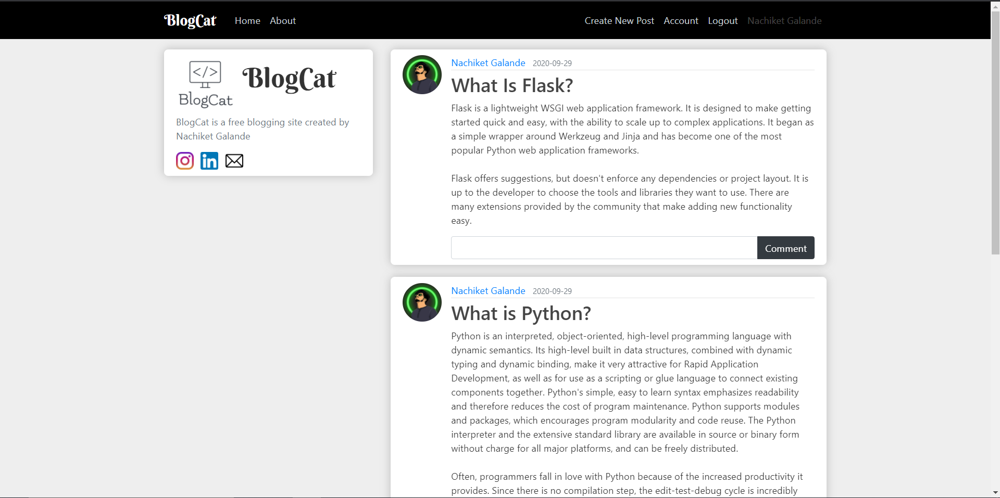
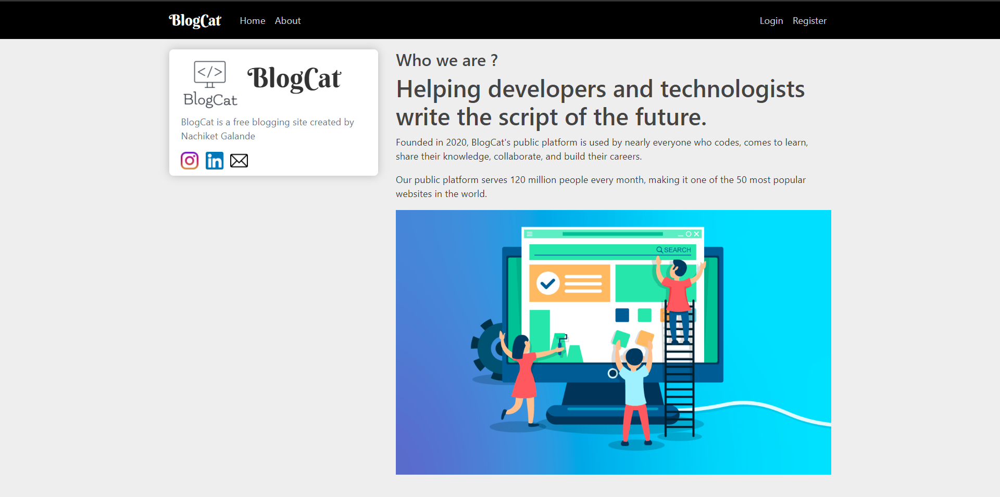
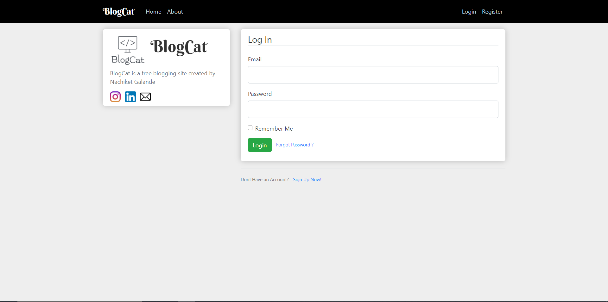

Helping developers and technologists write the script of the future.

Founded in 2020, BlogCat's public platform is used by nearly everyone who codes, comes to learn, share their knowledge, collaborate, and build their careers.

